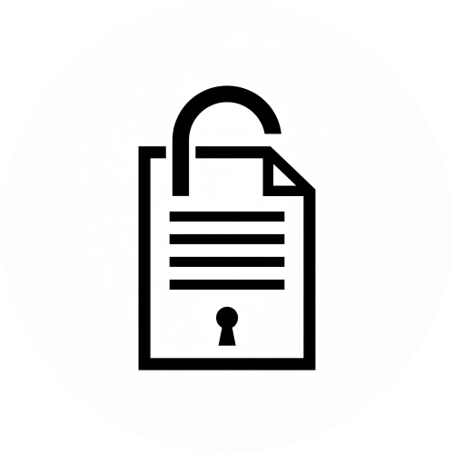

# DocUnlock



Remove password protection from PDFs. Built with FastAPI + vanilla JS.

## Installation on Linux & Mac

```bash
python3 -m venv venv
source venv/bin/activate
pip install -r requirements.txt
uvicorn main:app --host 0.0.0.0 --port 8000
```

## Installation on Windows

```bash
python -m venv venv
venv\Scripts\activate
pip install -r requirements.txt
uvicorn main:app --host 0.0.0.0 --port 8000
```

## Admin Access

To access the admin page for monitoring jobs:

1. Create a `.env` file in the project root.
2. Add your admin passphrase: `ADMIN_PASSPHRASE=your_secret_passphrase`
3. Visit `/admin-auth` to enter the passphrase and access the admin interface.

## Notes

- Queue max: 6 jobs. When full, uploads return HTTP 503.
- Files auto-deleted after 15 minutes.
- PDF authenticity checked by file header (first 4 bytes = `%PDF`), not extension.
- Max file size: 50 MB.